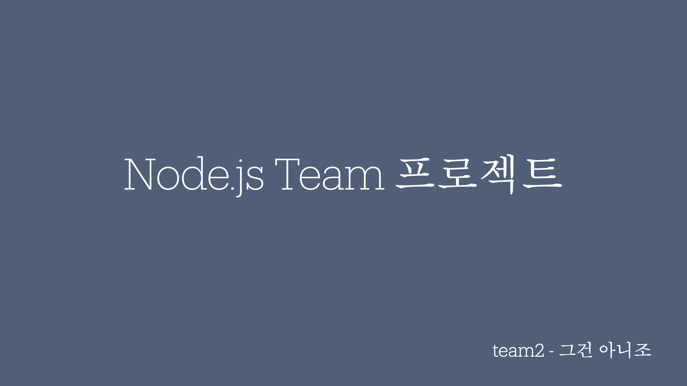
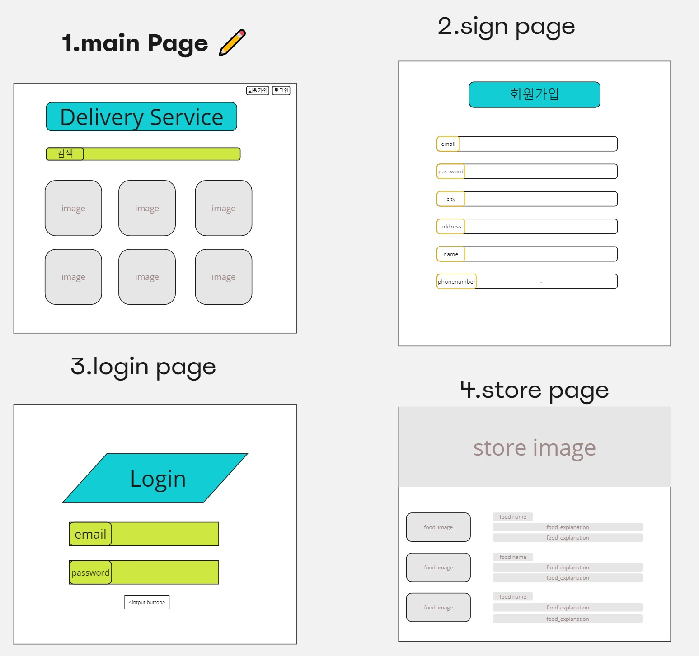

# Team 2 그건 아니조 Node.js 배달 서비스 프로젝트

## 프로젝트 소개

-   프로젝트 이름 : 밥 좀 주유소
-   목표 : 음식 배달 어플리케이션 백엔드 구축
-   GitHub : https://github.com/KAPUIST/Node_Food_Delivery_Service
-   시연 영상 : https://www.youtube.com/watch?v=mIOvjcaBeq8
-   배포 : https://currypang.shop/

 

## 팀원 구성

-   팀원 : 손태권 [@KAPUIST](https://github.com/KAPUIST)
-   팀원 : 오승민 [@seungminOh2024](https://github.com/seungminOh2024)
-   팀원 : 채유일 [@currypang](https://github.com/currypang)
-   팀원 : 이윤형 [@clearghost3](https://github.com/clearghost3)

 

## 1. 개발 기간

-   2024.06.17 ~ 2024.06.21

 

## 2. 개발 환경

-   운영체제 : Window/Mac
-   FrontEnd : X
-   BackEnd : Node.js, Express, MySQL(Prisma), REDIS
-   Tool : Visual Studio Code, Insomnia, MySQL Workbench, DBeaver
-   Publish : PM2, AWS/RDS, AWS/EC2, AWS/load balancer

 

## 3. 역할 분배

-   **손태권**
    -   음식 주문, 주문 전체 및 개별 확인, 주문 수락, 주문 완료 API 구현
    -   리뷰 생성, 리뷰 조회, 리뷰 수정, 리뷰 삭제 API 구현, 음식점 검색 API 구현
    -   REDIS적용, 알림 구현
    -   스키마 작성, 관리
-   **오승민**
    -   메뉴 생성, 메뉴 조회, 메뉴 수정, 메뉴 삭제 API 구현
-   **이윤형**
    -   업장 생성, 업장 조회, 업장 수정, 업장 삭제, 업장 복구 API
    -   유저 정보 조회, 유저 정보 수정, 유저 정보 삭제, 포인트 충전 API 구현
    -   와이어 프레임 작성
-   **채유일**
    -   회원가입, 로그인, 로그아웃, 메일 인증, 토큰 재발급 API 구현
    -   accessToken 미들웨어, refreshToken 미들웨어, 에러 관련 로직 구현
    -   Joi 유효성 검사, readme 작성

 

## 4. API 명세서 및 ERD, 와이어 프레임

-   API 명세서 : https://www.notion.so/teamsparta/013686667ac6424190f394610347af6c?v=9fdbff9cbb3b4797aefab6216531125d
-   ERD : https://drawsql.app/teams/-1278/diagrams/node-delivery

 

## 5. 주요 기능 및 설명

### 5-1. 이메일 인증 API

-   회원 가입에 사용되는 이메일 인증 코드를 요청, 반환하는 API입니다.

-   이메일 인증을 위해 Nodemailer패키지를 사용했습니다.

-   REDIS를 이용해 비교할 인증코드를 저장합니다.

-   생성된 인증 코드를 Redis에 저장 후 반환합니다.

 https://github.com/KAPUIST/Node_Food_Delivery_Service/blob/298a4e25843cfb56087578af7bab032ffe09cb9f/src/services/auth.service.js#L56

### 5-2. 회원가입 API

-   **이메일, 비밀번호, 비밀번호 확인, 닉네임, 지역, 주소, 성별, 전화번호, 포인트, 이메일 인증 코드**를 `req.body`로 전달 받습니다.

-   **보안을 위해 비밀번호는** **bcrypt**를 사용해 `Hash` 된 값을 저장합니다.

-   생성된 회원 정보를 DB 저장 후 반환합니다.

 https://github.com/KAPUIST/Node_Food_Delivery_Service/blob/298a4e25843cfb56087578af7bab032ffe09cb9f/src/services/auth.service.js#L16

### 5-3. 로그인 API

-   **이메일, 비밀번호**를 `req.body`로 전달 받습니다.

-   **AccessToken**(`사용자 ID`를 포함, **만료기한** `12시간`)을 생성합니다.

-   **RefreshToken**(`사용자 ID`를 포함, **만료기한** `7일`)을 생성합니다.

-   AccessToken과 RefreshToken을 DB 저장 후 반환합니다.

 https://github.com/KAPUIST/Node_Food_Delivery_Service/blob/27c3e819a44f3c994fe93ed2173f72792f3a9b47/src/services/auth.service.js#L92

### 5-4. 토큰 재발급 API

-   `Refresh Token`를 새롭게 발급 API입니다.

-   `Refresh Token`을 `Header`로 받아와서 `DB에 있는 토큰`과 비교합니다.

-   토큰 유효성 검사가 통과하면 새로운 Refresh 토큰을 재발급 받습니다.

-   AccessToken과 RefreshToken을 DB 저장 후 반환합니다.

 https://github.com/KAPUIST/Node_Food_Delivery_Service/blob/27c3e819a44f3c994fe93ed2173f72792f3a9b47/src/services/auth.service.js#L114

### 5-5. 로그아웃 API

-   사용자가 로그아웃을 요청하는 API입니다.

-   `refreshToken`미들웨어로 통해서 로그인한 사용자의 Refresh Token를 검증합니다.

-   검증을 통과하면 DB에 있는 기존 Refresh Token을 `null`값으로 변경하여 폐기합니다.

-   삭제된 사용자의 ID 값을 반환합니다.

 https://github.com/KAPUIST/Node_Food_Delivery_Service/blob/27c3e819a44f3c994fe93ed2173f72792f3a9b47/src/services/auth.service.js#L109

### 5-6. 사용자 프로필 조회 API

-   로그인한 사용자의 정보를 조회하는 API입니다.

-   `accessToken`미들웨어 를 통해 로그인한 사용자의 `Access Token`를 검증합니다.

-   검증을 통과하면 `req.user`를 통해 사용자의 정보를 가져옵니다.

-   조회된 사용자의 정보를 반환합니다.

 https://github.com/KAPUIST/Node_Food_Delivery_Service/blob/298a4e25843cfb56087578af7bab032ffe09cb9f/src/services/users.service.js#L19

### 5-7. 사용자 정보 수정 API

-   유저의 정보를 수정하는 API입니다.

-   `accessToken`미들웨어 를 통해 로그인한 사용자의 `Access Token`를 검증합니다.

-   검증을 통과하면 `req.user`를 통해 사용자의 정보를 가져옵니다.

-   비밀번호, 지역, 주소, 전화 번호를 `req.body`를 통해 받아옵니다.

-   수정 성공시 메시지를 반환합니다.

  https://github.com/KAPUIST/Node_Food_Delivery_Service/blob/298a4e25843cfb56087578af7bab032ffe09cb9f/src/services/users.service.js#L36

### 5-8. 사용자 계정 삭제 API

-   유저의 정보를 삭제하는 API입니다.

-   `accessToken`미들웨어 를 통해 로그인한 사용자의 `Access Token`를 검증합니다.

-   검증을 통과하면 `req.user`를 통해 사용자의 정보를 가져옵니다.

-   비밀번호를 `req.body`를 통해 받아옵니다.

-   삭제 성공시 메시지를 반환합니다.

 https://github.com/KAPUIST/Node_Food_Delivery_Service/blob/298a4e25843cfb56087578af7bab032ffe09cb9f/src/services/users.service.js#L62

### 5-9. 사용자 포인트 충전 API

-   유저가 보유한 포인트를 충전할 수 있는 API입니다.

-   `accessToken`미들웨어 를 통해 로그인한 사용자의 `Access Token`를 검증합니다.

-   검증을 통과하면 `req.user`를 통해 사용자의 정보를 가져옵니다.

-   충전할 포인트를 `req.body`를 통해 받아옵니다.

-   충전후 변경된 포인트를 반환합니다.

 https://github.com/KAPUIST/Node_Food_Delivery_Service/blob/27c3e819a44f3c994fe93ed2173f72792f3a9b47/src/services/users.service.js#L79

### 5-10. 사장 업장 생성 API

-   점주가 업장을 생성하는 API 입니다.

-   `accessToken`미들웨어 를 통해 로그인한 사용자의 `Access Token`를 검증합니다.

-   검증을 통과하면 `req.user`를 통해 사용자의 정보를 가져옵니다.

-   가게이름, 지역, 주소, 음식타입을 `req.body`를 통해 받아옵니다.

-   성공 시 메시지를 반환합니다.
    

 https://github.com/KAPUIST/Node_Food_Delivery_Service/blob/27c3e819a44f3c994fe93ed2173f72792f3a9b47/src/services/owner.service.js#L16

### 5-11. 사장 업장 조회 API

-   점주가 업장 정보를 조회하는 API입니다.

-   `accessToken`미들웨어 를 통해 로그인한 사용자의 `Access Token`를 검증합니다.

-   검증을 통과하면 `req.user`를 통해 사용자의 정보를 가져옵니다.

-   조회된 업장의 정보를 반환합니다.

 https://github.com/KAPUIST/Node_Food_Delivery_Service/blob/27c3e819a44f3c994fe93ed2173f72792f3a9b47/src/services/owner.service.js#L34

### 5-12. 사장 업장 수정 API

-   점주가 업장 정보를 수정하는 API입니다.

-   `accessToken`미들웨어 를 통해 로그인한 사용자의 `Access Token`를 검증합니다.

-   검증을 통과하면 `req.user`를 통해 사용자의 정보를 가져옵니다.

-   가게이름, 지역, 주소, 음식타입을 `req.body`를 통해 받아옵니다.

-   수정된 업장의 정보를 반환합니다.

 https://github.com/KAPUIST/Node_Food_Delivery_Service/blob/27c3e819a44f3c994fe93ed2173f72792f3a9b47/src/services/owner.service.js#L50

### 5-13. 사장 업장 삭제 API

-   점주가 업장 정보를 삭제하는 API입니다.

-   `accessToken`미들웨어 를 통해 로그인한 사용자의 `Access Token`를 검증합니다.

-   검증을 통과하면 `req.user`를 통해 사용자의 정보를 가져옵니다.

-   삭제 성공시 메시지를 반환합니다.

 https://github.com/KAPUIST/Node_Food_Delivery_Service/blob/27c3e819a44f3c994fe93ed2173f72792f3a9b47/src/services/owner.service.js#L73

### 5-14. 사장 업장 복구 API

-   점주가 업장 정보를 복구하는 API입니다.

-   `accessToken`미들웨어 를 통해 로그인한 사용자의 `Access Token`를 검증합니다.

-   검증을 통과하면 `req.user`를 통해 사용자의 정보를 가져옵니다.

-   폐업된 가게의 번호를 `req.body`를 통해 받아옵니다.

-   복구된 업장의 정보를 반환합니다.

 https://github.com/KAPUIST/Node_Food_Delivery_Service/blob/27c3e819a44f3c994fe93ed2173f72792f3a9b47/src/services/owner.service.js#L91

### 5-15. 가게 메뉴 생성 API

-   점주가 가게의 메뉴를 생성하는 API 입니다.

-   `accessToken`미들웨어 를 통해 로그인한 사용자의 `Access Token`를 검증합니다.

-   검증을 통과하면 `req.user`를 통해 사용자의 정보를 가져옵니다.

-   메뉴이름과 가격을 `req.body`를 통해 받아옵니다.

-   생성된 메뉴의 정보를 반환합니다.

 https://github.com/KAPUIST/Node_Food_Delivery_Service/blob/9483135da967a327b9be8de1e1e0adda280feaf0/src/services/menus.service.js#L10

### 5-16. 가게 메뉴 조회 API

-   점주가 가게의 메뉴를 조회하는 API 입니다.

-   가게 ID 정보를 `req.params`를 통해 가져옵니다.

-   정렬 방식을 `req.query`를 통해 가져옵니다.

-   조회된 메뉴의 정보를 반환합니다.

 https://github.com/KAPUIST/Node_Food_Delivery_Service/blob/9483135da967a327b9be8de1e1e0adda280feaf0/src/services/menus.service.js#L26

### 5-17. 가게 메뉴 수정 API

-   점주가 가게의 메뉴를 수정하는 API 입니다.

-   `accessToken`미들웨어 를 통해 로그인한 사용자의 `Access Token`를 검증합니다.

-   검증을 통과하면 `req.user`를 통해 사용자의 정보를 가져옵니다.

-   메뉴 ID 정보를 `req.params`를 통해 가져옵니다.

-   메뉴이름과 가격을 `req.body`를 통해 받아옵니다.

-   조회된 메뉴의 정보를 반환합니다.

 https://github.com/KAPUIST/Node_Food_Delivery_Service/blob/9483135da967a327b9be8de1e1e0adda280feaf0/src/services/menus.service.js#L41

### 5-18. 가게 메뉴 삭제 API

-   점주가 가게의 메뉴를 삭제하는 API 입니다.

-   `accessToken`미들웨어 를 통해 로그인한 사용자의 `Access Token`를 검증합니다.

-   검증을 통과하면 `req.user`를 통해 사용자의 정보를 가져옵니다.

-   메뉴 ID 정보를 `req.params`를 통해 가져옵니다.

-   삭제된 메뉴의 정보를 반환합니다.

 https://github.com/KAPUIST/Node_Food_Delivery_Service/blob/9483135da967a327b9be8de1e1e0adda280feaf0/src/services/menus.service.js#L60

### 5-19. 유저 음식점 검색 API

-   고객이 음식점을 검색하는 API입니다.

-   `accessToken`미들웨어 를 통해 로그인한 사용자의 `Access Token`를 검증합니다.

-   검증을 통과하면 `req.user`를 통해 사용자의 정보를 가져옵니다.

-   검색조건을 `req.query`를 통해 가져옵니다.

-   조건에 따라 조회된 식당 목록을 반환합니다.

 https://github.com/KAPUIST/Node_Food_Delivery_Service/blob/9483135da967a327b9be8de1e1e0adda280feaf0/src/repositories/search.repository.js#L6

### 5-20. 유저 음식점 주문 API

-   고객이 음식을 주문하는 API입니다.

-   `accessTokenValidator`를 통해서 로그인한 사용자의 `Access Token`를 검증합니다.

-   토큰 유효성 검사가 통과하면 `req.user`를 통해 사용자의 정보를 가져옵니다.

-   주문 생성 시 사장님께 알람이 전송됩니다.

-   주문 정보를 반환합니다.

 https://github.com/KAPUIST/Node_Food_Delivery_Service/blob/9483135da967a327b9be8de1e1e0adda280feaf0/src/services/orders.service.js#L92

### 5-21. 가게 음식점 주문 확인 API

-   가게로 들어온 모든 주문을 확인하는 API 입니다.

-   `accessTokenValidator`를 통해서 로그인한 사용자의 `Access Token`를 검증합니다.

-   토큰 유효성 검사가 통과하면 `req.user`를 통해 사용자의 정보를 가져옵니다.

-   주문 상태와 가게 ID를 `req.query`를 통해 받아옵니다.

-   가게의 전체 주문 목록을 상태 조건에 따라 반환합니다.

 https://github.com/KAPUIST/Node_Food_Delivery_Service/blob/9483135da967a327b9be8de1e1e0adda280feaf0/src/controllers/orders.controller.js#L48

### 5-22. 가게 음식점 개별 주문 확인 API

-   가게로 들어온 개별 주문을 확인하는 API 입니다.

-   `accessTokenValidator`를 통해서 로그인한 사용자의 `Access Token`를 검증합니다.

-   토큰 유효성 검사가 통과하면 `req.user`를 통해 사용자의 정보를 가져옵니다.

-   주문 ID를 `req.params`를 통해 받아옵니다.

-   주문 정보를 반환합니다.

 https://github.com/KAPUIST/Node_Food_Delivery_Service/blob/9483135da967a327b9be8de1e1e0adda280feaf0/src/controllers/orders.controller.js#L26

### 5-23. 가게 음식점 주문 수락 API

-   가게로 들어온 주문을 수락(주문 상태 변경)하는 API 입니다.

-   `accessTokenValidator`를 통해서 로그인한 사용자의 `Access Token`를 검증합니다.

-   토큰 유효성 검사가 통과하면 `req.user`를 통해 사용자의 정보를 가져옵니다.

-   주문 ID를 `req.params`를 통해 받아옵니다.

-   변경할 상태를 `req.body`를 통해 받아옵니다.

-   변경된 상태와, 고객ID, 가게 ID를 반환합니다.

 https://github.com/KAPUIST/Node_Food_Delivery_Service/blob/9483135da967a327b9be8de1e1e0adda280feaf0/src/controllers/orders.controller.js#L70

### 5-24. 가게 음식점 배달 완료 API

-   가게로 들어온 주문의 상태를 완료하는 API 입니다.

-   `accessTokenValidator`를 통해서 로그인한 사용자의 `Access Token`를 검증합니다.

-   토큰 유효성 검사가 통과하면 `req.user`를 통해 사용자의 정보를 가져옵니다.

-   주문 ID를 `req.params`를 통해 받아옵니다.

-   변경된 상태와, 고객ID, 가게 ID를 반환합니다.

 https://github.com/KAPUIST/Node_Food_Delivery_Service/blob/9483135da967a327b9be8de1e1e0adda280feaf0/src/controllers/orders.controller.js#L103

### 5-25. 유저 리뷰 작성 API

-   주문에 대한 유저의 리뷰 작성 API 입니다.

-   `accessTokenValidator`를 통해서 로그인한 사용자의 `Access Token`를 검증합니다.

-   토큰 유효성 검사가 통과하면 `req.user`를 통해 사용자의 정보를 가져옵니다.

-   주문 ID를 `req.params`를 통해 받아옵니다.

-   가게 ID를 `req.query`를 통해 받아옵니다.

-   평점과 코멘트를 `req.body`를 통해 받아옵니다.

-   생성한 리뷰 정보를 반환합니다.

 https://github.com/KAPUIST/Node_Food_Delivery_Service/blob/9483135da967a327b9be8de1e1e0adda280feaf0/src/controllers/reviewsController.js#L28

### 5-26. 유저 리뷰 조회 API

-   가게에 대한 유저의 리뷰 조회 API 입니다.

-   가게 ID를 `req.params`를 통해 받아옵니다.

-   정렬 순서를 `req.query`를 통해 받아옵니다.

-   조회한 리뷰 정보를 반환합니다.

 https://github.com/KAPUIST/Node_Food_Delivery_Service/blob/9483135da967a327b9be8de1e1e0adda280feaf0/src/controllers/reviewsController.js#L8

### 5-27. 유저 리뷰 수정 API

-   주문에 대한 유저의 리뷰 수정 API 입니다.

-   `accessTokenValidator`를 통해서 로그인한 사용자의 `Access Token`를 검증합니다.

-   토큰 유효성 검사가 통과하면 `req.user`를 통해 사용자의 정보를 가져옵니다.

-   리뷰 ID를 `req.params`를 통해 받아옵니다.

-   수정할 평점과 코멘트를 `req.body`를 통해 받아옵니다.

-   수정한 리뷰 정보를 반환합니다.

 https://github.com/KAPUIST/Node_Food_Delivery_Service/blob/9483135da967a327b9be8de1e1e0adda280feaf0/src/controllers/reviewsController.js#L42

## 5-28. 유저 리뷰 삭제 API

-   주문에 대한 유저의 리뷰 삭제 API 입니다.

-   `accessTokenValidator`를 통해서 로그인한 사용자의 `Access Token`를 검증합니다.

-   토큰 유효성 검사가 통과하면 `req.user`를 통해 사용자의 정보를 가져옵니다.

-   리뷰 ID를 `req.params`를 통해 받아옵니다.

-   삭제한 리뷰의 ID를 반환합니다.

 https://github.com/KAPUIST/Node_Food_Delivery_Service/blob/9483135da967a327b9be8de1e1e0adda280feaf0/src/controllers/reviewsController.js#L55

## 5-29. 랭크순 가게 조회 API

-   매출액 기준 랭크순 가게 조회 API 입니다.

-   랭크순으로 정렬된 가게 목록을 반환합니다.

 https://github.com/KAPUIST/Node_Food_Delivery_Service/blob/9483135da967a327b9be8de1e1e0adda280feaf0/src/controllers/rank.controller.js#L5

## 6. 트러블 슈팅

### 6-1

-   문제 상황 - 데이터베이스에서 Cascade 삭제를 사용하면 특정 데이터를 삭제할 때 그와 연결된 모든 관련 데이터 도 함께 삭제되는 문제가 있었습니다.
-   해결 방법 - 소프트 딜리트를 도입하여 데이터를 실제로 삭제하지 않고, 삭제된것으로 표시하는 방법을 사용했습니다. 이를 위해 테이블에 컬럼을 추가하여 . 데이터가 삭제된것처럼 표시하되 실제로는 데이터가 남아 있도록 해결하였습니다.

### 6-2

-   문제 상황 - 프로젝트 진행중 맡은 부분을 일부 완성 하지 못한 경험이 있었습니다.
-   해결 방법 - 팀원들과, 서로 돕고 협력함으로써 어려운 문제를 극복할수 있었습니다, 특히 팀워크와 협업의 중요성을 깊이 깨달을수 있었습니다.

### 6-3

-   문제 상황 - 유효성 검사와 상수의 변수 처리를 관리할때, 다른 팀원들이 같은 파일이나 변수에 접근하면서 충돌이 발생했습니다.
-   해결 방법 - 코드 리뷰와 커뮤니케이션을 통해 작업의 우선순위를 명확히 하고, 중요한 변경 사항을 먼저 처리함으로써 문제를 효과적으로 해결하였습니다.
